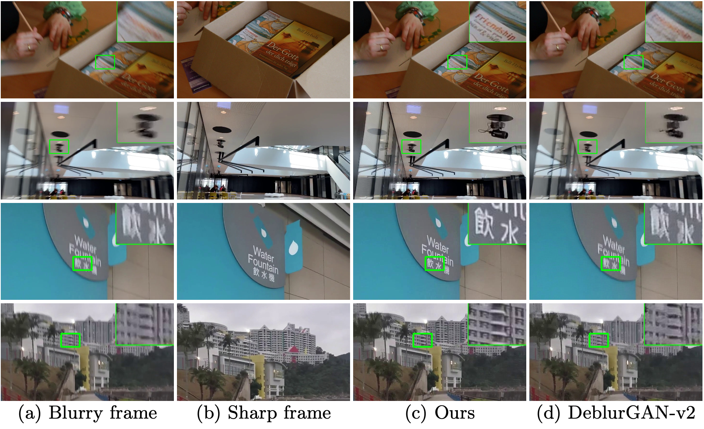
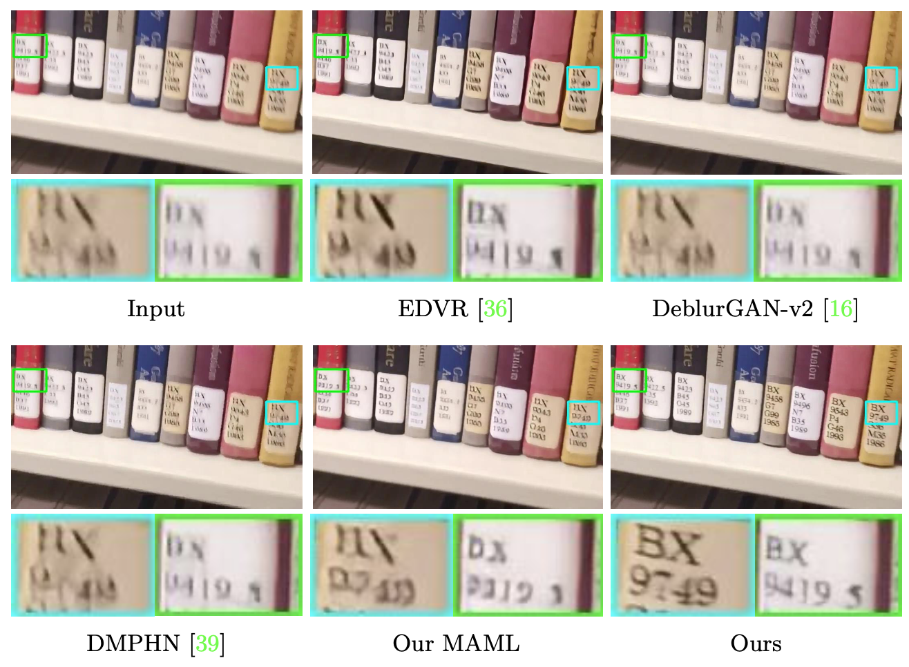
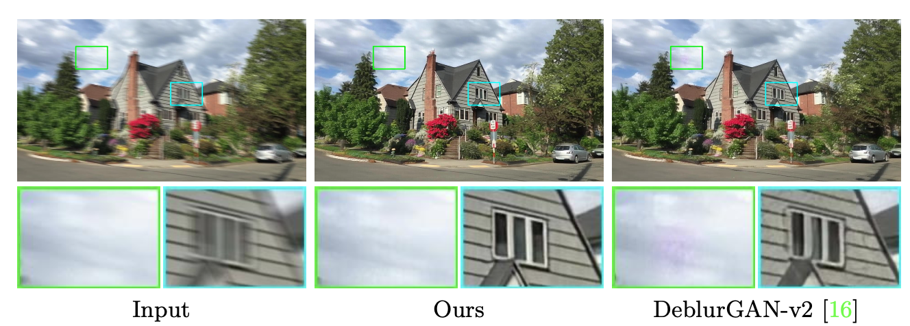

# Video Deblurring by Fitting to Test Data

Tensorflow implementation for this paper by [Xuanchi Ren*](https://xuanchiren.com), Zian Qian*, [Qifeng Chen](https://cqf.io/)

\* indicates equal contribution

[Paper]()  |  [Project Page](https://xuanchiren.com/pub/blur)

The demo video is shown at: 

The dataset and the code for training will be released.

